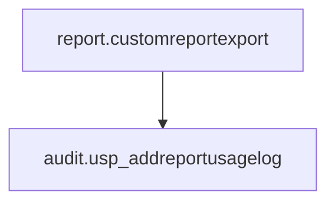

## Execution Tree — report.customreportexport

```mermaid
graph TD
    audit_usp_addreportusagelog[audit.usp_addreportusagelog]
    report_customreportexport[report.customreportexport] --> audit_usp_addreportusagelog[audit.usp_addreportusagelog]
```
