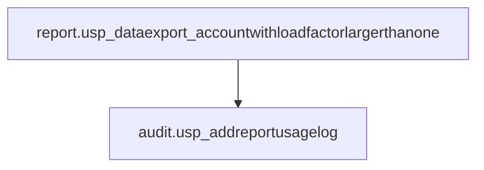

## Execution Tree — report.usp_dataexport_accountwithloadfactorlargerthanone

```mermaid
graph TD
    audit_usp_addreportusagelog[audit.usp_addreportusagelog]
    report_usp_dataexport_accountwithloadfactorlargerthanone[report.usp_dataexport_accountwithloadfactorlargerthanone] --> audit_usp_addreportusagelog[audit.usp_addreportusagelog]
```
