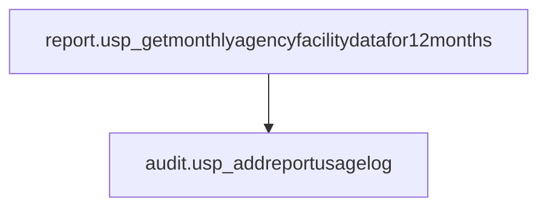

## Execution Tree — report.usp_getmonthlyagencyfacilitydatafor12months

```mermaid
graph TD
    audit_usp_addreportusagelog[audit.usp_addreportusagelog]
    report_usp_getmonthlyagencyfacilitydatafor12months[report.usp_getmonthlyagencyfacilitydatafor12months] --> audit_usp_addreportusagelog[audit.usp_addreportusagelog]
```
