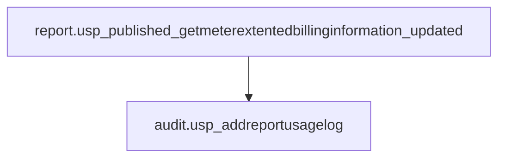

## Execution Tree — report.usp_published_getmeterextentedbillinginformation_updated

```mermaid
graph TD
    audit_usp_addreportusagelog[audit.usp_addreportusagelog]
    report_usp_published_getmeterextentedbillinginformation_updated[report.usp_published_getmeterextentedbillinginformation_updated] --> audit_usp_addreportusagelog[audit.usp_addreportusagelog]
```
