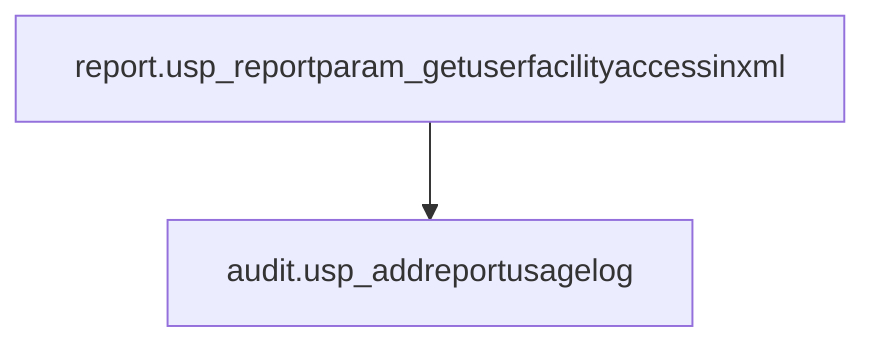

## Execution Tree — report.usp_reportparam_getuserfacilityaccessinxml

```mermaid
graph TD
    audit_usp_addreportusagelog[audit.usp_addreportusagelog]
    report_usp_reportparam_getuserfacilityaccessinxml[report.usp_reportparam_getuserfacilityaccessinxml] --> audit_usp_addreportusagelog[audit.usp_addreportusagelog]
```
