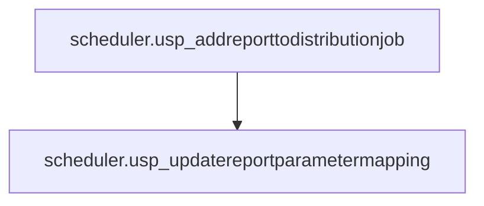

## Execution Tree — scheduler.usp_addreporttodistributionjob

```mermaid
graph TD
    scheduler_usp_updatereportparametermapping[scheduler.usp_updatereportparametermapping]
    scheduler_usp_addreporttodistributionjob[scheduler.usp_addreporttodistributionjob] --> scheduler_usp_updatereportparametermapping[scheduler.usp_updatereportparametermapping]
```
