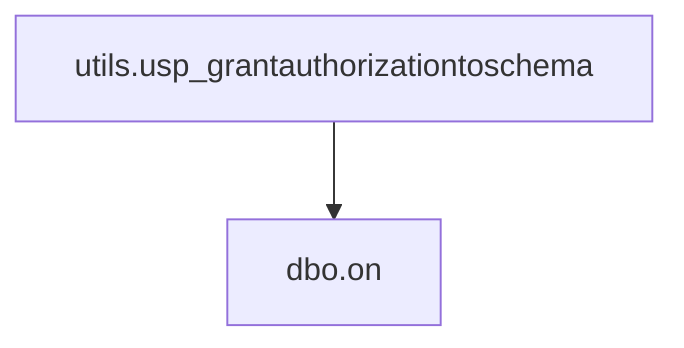

## Execution Tree — utils.usp_grantauthorizationtoschema

```mermaid
graph TD
    dbo_on[dbo.on]
    utils_usp_grantauthorizationtoschema[utils.usp_grantauthorizationtoschema] --> dbo_on[dbo.on]
```
