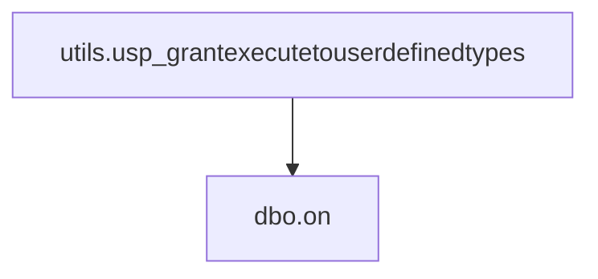

## Execution Tree — utils.usp_grantexecutetouserdefinedtypes

```mermaid
graph TD
    dbo_on[dbo.on]
    utils_usp_grantexecutetouserdefinedtypes[utils.usp_grantexecutetouserdefinedtypes] --> dbo_on[dbo.on]
```
