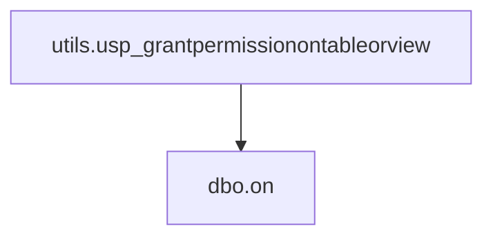

## Execution Tree — utils.usp_grantpermissionontableorview

```mermaid
graph TD
    dbo_on[dbo.on]
    utils_usp_grantpermissionontableorview[utils.usp_grantpermissionontableorview] --> dbo_on[dbo.on]
```
