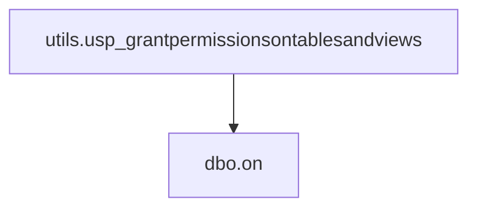

## Execution Tree — utils.usp_grantpermissionsontablesandviews

```mermaid
graph TD
    dbo_on[dbo.on]
    utils_usp_grantpermissionsontablesandviews[utils.usp_grantpermissionsontablesandviews] --> dbo_on[dbo.on]
```
