# Stored Procedure Flow & Logic (Non‑Technical Overview)

This document was generated by asking an AI assistant (ChatGPT) to read each stored procedure's SQL and explain, in non‑technical language, what it does and how any other procedures it calls fit into the overall flow.


## Billing.usp_AddNewAgency

### 1. Overview

The stored procedure `Billing.usp_AddNewAgency` is designed to add a new agency to the billing system. Its primary purpose is to ensure that a new agency is correctly recorded in the system with all necessary details, such as its name, billing codes, and hierarchy within the organization. This procedure is part of a larger process that manages agency data, ensuring that new entries are validated and integrated into the existing structure.

The procedure first checks if the agency already exists. If it doesn't, it inserts the new agency's details into the database. It then updates the agency's hierarchical information, which helps in organizing agencies under parent divisions. Finally, it calls another procedure, `Billing.usp_AddAgencyFundingGroup`, to associate the new agency with a specific funding group. This ensures that the agency is linked to the correct financial resources and reporting structures.

### 2. Flow Diagram (Mermaid)

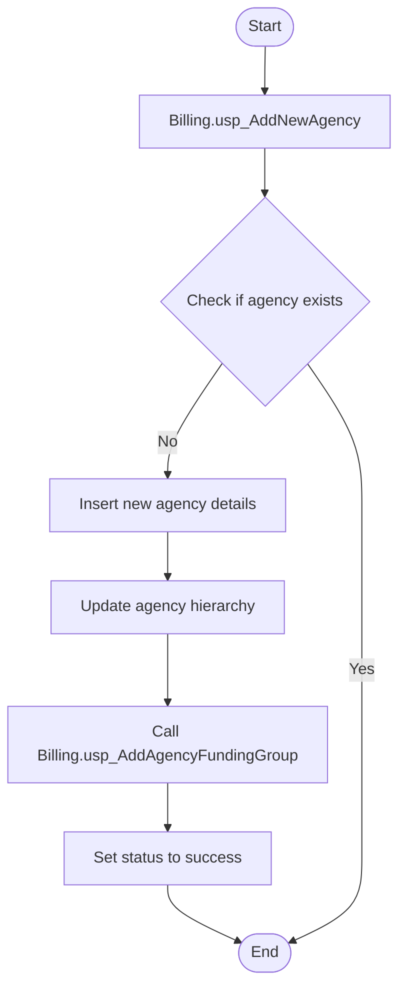

### 3. Step-by-Step Narrative (Complete Call Tree)

1. **Start the Process**: The procedure begins by attempting to add a new agency to the billing system. It receives various details about the agency, such as its name, codes, and billing information.

2. **Check for Existing Agency**: It first checks if the agency already exists in the system by looking up its unique code. This step ensures that duplicate entries are not created.

3. **Insert New Agency Details**: If the agency does not exist, the procedure inserts the new agency's details into the database. This includes information like the agency's name, billing codes, and other descriptive data.

4. **Update Agency Hierarchy**: After inserting the new agency, the procedure updates its hierarchical information. This step organizes the agency within the existing structure, linking it to a parent division if applicable.

5. **Call Billing.usp_AddAgencyFundingGroup**: The procedure then calls another stored procedure, `Billing.usp_AddAgencyFundingGroup`, to associate the new agency with a funding group. This ensures that the agency is connected to the appropriate financial resources and reporting structures.

6. **Set Status to Success**: Once all steps are completed successfully, the procedure sets a status code indicating success. This status can be used by other parts of the system to confirm that the agency was added correctly.

7. **End the Process**: The procedure concludes, having successfully integrated the new agency into the billing system, ready for further operations and reporting.

---

## Common.usp_CONED_HandleExchangeDataIssues

### 1. Overview

The stored procedure `[Common].[usp_CONED_HandleExchangeDataIssues]` is designed to manage and resolve discrepancies between billing data files and the billing records stored in the database. Its primary purpose is to ensure that all accounts and meters are accurately recorded and updated in the system, particularly focusing on missing or incorrect data entries. This procedure is part of a larger data management process that ensures the integrity and completeness of billing information, which is crucial for accurate billing and customer account management.

The procedure begins by determining the current billing period, which is essential for processing the correct set of data. Although the procedure contains a commented-out call to another stored procedure, `[Common].CopyConEdExchangeDataToCommon`, this call is not currently active. If it were active, it would likely be responsible for copying or synchronizing data between different parts of the system. The main body of the procedure involves updating and inserting records into the `Common.ExchangeData` table, ensuring that missing accounts and meters are added and that existing records are corrected as needed. This includes setting default values, handling missing information, and ensuring that all necessary fields are populated for accurate billing.

### 2. Flow Diagram (Mermaid)

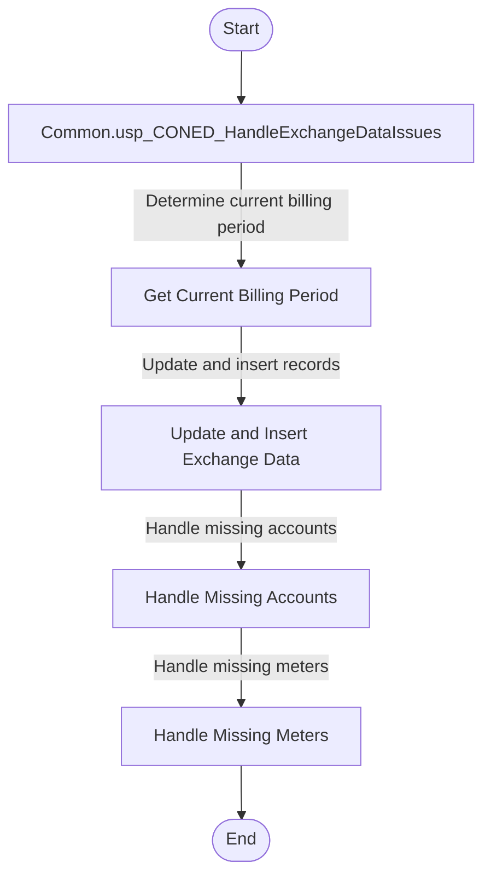

### 3. Step-by-Step Narrative (Complete Call Tree)

1. **Determine Current Billing Period**: The procedure starts by identifying the current billing period. This is done by querying the `Billing.ApplicationTimeFrame` table to find the period marked as currently being processed. This step ensures that all subsequent operations are aligned with the correct billing cycle.

2. **Update and Insert Exchange Data**: The procedure then focuses on updating and inserting records into the `Common.ExchangeData` table. This involves:
   - Updating existing records where certain conditions are met, such as setting the current meter number to the original meter number if it is missing.
   - Inserting new records for accounts and meters that are missing from the billing data. This ensures that all necessary data is present for accurate billing.

3. **Handle Missing Accounts**: The procedure checks for accounts that are present in the uploaded data but missing from the billing records. It inserts these accounts into the `Common.ExchangeData` table, setting default values for various fields to ensure completeness.

4. **Handle Missing Meters**: Similarly, the procedure addresses missing meter data by inserting records for meters that are present in the uploaded data but not in the billing records. This step ensures that all meter-related information is accurately captured.

5. **End**: The procedure concludes after ensuring that all necessary updates and insertions have been made, leaving the billing data in a state that is ready for further processing or reporting. The overall process ensures data integrity and completeness, which are critical for accurate billing and customer account management.

---

## Common.usp_ProcessExchangeData

### 1. Overview

The stored procedure `Common.usp_ProcessExchangeData` is designed to handle and process exchange data records for a specific billing period. Its primary role is to ensure that each piece of exchange data is processed according to its type, identified by an exchange code. This procedure is part of a larger data processing workflow that deals with billing and exchange data management.

The procedure begins by determining the current billing period and then selects exchange data records that need processing. It uses a priority system to decide the order in which these records are processed. For each record, it checks the exchange code and calls a specific sub-procedure to handle the processing for that type of exchange data. These sub-procedures are responsible for the detailed processing logic specific to each exchange code.

The sub-procedures called by `Common.usp_ProcessExchangeData` include:
- `Common.usp_ProcessExchange_Code47`
- `Common.usp_ProcessExchange_CodeAX`
- `Common.usp_ProcessExchange_Code46`
- `Common.usp_ProcessExchange_Code45`
- `Common.usp_ProcessExchange_Code27`
- `Common.usp_ProcessExchange_Code28`
- `Common.usp_ProcessExchange_CodeMISC`

Each of these sub-procedures is tailored to process exchange data with a specific code, ensuring that the data is handled correctly according to business rules. The overall process ensures that all relevant exchange data is processed efficiently and accurately, updating the status and message outputs to reflect the success or failure of the operations.

### 2. Flow Diagram (Mermaid)

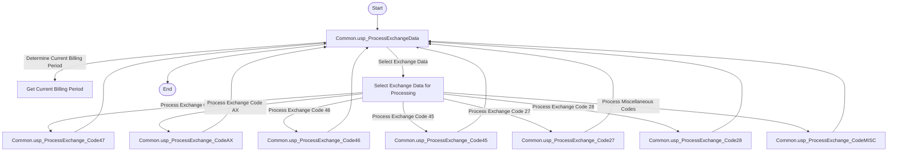

### 3. Step-by-Step Narrative (Complete Call Tree)

1. **Determine Current Billing Period**: The procedure starts by identifying the current billing period from the system's timeframe settings. This ensures that all processing is aligned with the correct billing cycle.

2. **Select Exchange Data for Processing**: It then selects exchange data records that need to be processed. These records are filtered based on criteria such as billing group, processing status, and exclusion flags. The records are prioritized based on their exchange codes.

3. **Process Each Exchange Data Record**: For each selected record, the procedure checks the exchange code and calls the corresponding sub-procedure to handle the processing:
   - **Exchange Code 47**: Calls `Common.usp_ProcessExchange_Code47` to process records with this code.
   - **Exchange Code AX**: Calls `Common.usp_ProcessExchange_CodeAX` for records with this code.
   - **Exchange Code 46**: Calls `Common.usp_ProcessExchange_Code46` for records with this code.
   - **Exchange Code 45**: Calls `Common.usp_ProcessExchange_Code45` for records with this code.
   - **Exchange Code 27**: Calls `Common.usp_ProcessExchange_Code27` for records with this code.
   - **Exchange Code 28**: Calls `Common.usp_ProcessExchange_Code28` for records with this code.
   - **Miscellaneous Codes**: Calls `Common.usp_ProcessExchange_CodeMISC` for any other codes not specifically listed.

4. **Handle Processing Results**: After each sub-procedure call, the main procedure updates the status and message outputs to reflect the outcome of the processing. This includes handling any errors that may occur during processing.

5. **Complete the Process**: Once all records have been processed, the procedure concludes, ensuring that all exchange data for the current billing period has been handled according to the business rules. The final status and message outputs indicate the overall success or any issues encountered during the process.

---

## ConEd.usp_Upload_19_UploadDataToEC3

### 1. Overview

The stored procedure `[ConEd].[usp_Upload_19_UploadDataToEC3]` is designed to facilitate the transfer of data to a system referred to as EC3. This procedure is part of a larger data management process, likely involving the preparation and movement of utility-related data, such as customer accounts and meter readings, to ensure they are up-to-date and accurate in the EC3 system.

The procedure operates by initiating a transaction to ensure that all steps are completed successfully before finalizing the data transfer. If any step fails, the transaction is rolled back to maintain data integrity. Within this process, the root procedure calls three other helper procedures:

1. `[ConEd].[usp_Upload_19_helper_UploadAccountDataToEC3]`: This procedure likely handles the transfer of customer account information to EC3.
2. `[ConEd].[usp_Upload_19_helper_UploadMeterDataToEC3]`: This procedure probably manages the uploading of meter data, ensuring that usage information is current.
3. `[ConEd].[usp_Upload_19_helper_FixServiceClassificationDiscrepancy]`: This procedure seems to address and correct any discrepancies in service classifications, ensuring data consistency.

Overall, this workflow ensures that all relevant data is accurately uploaded to EC3, with mechanisms in place to handle errors and maintain data integrity.

### 2. Flow Diagram (Mermaid)

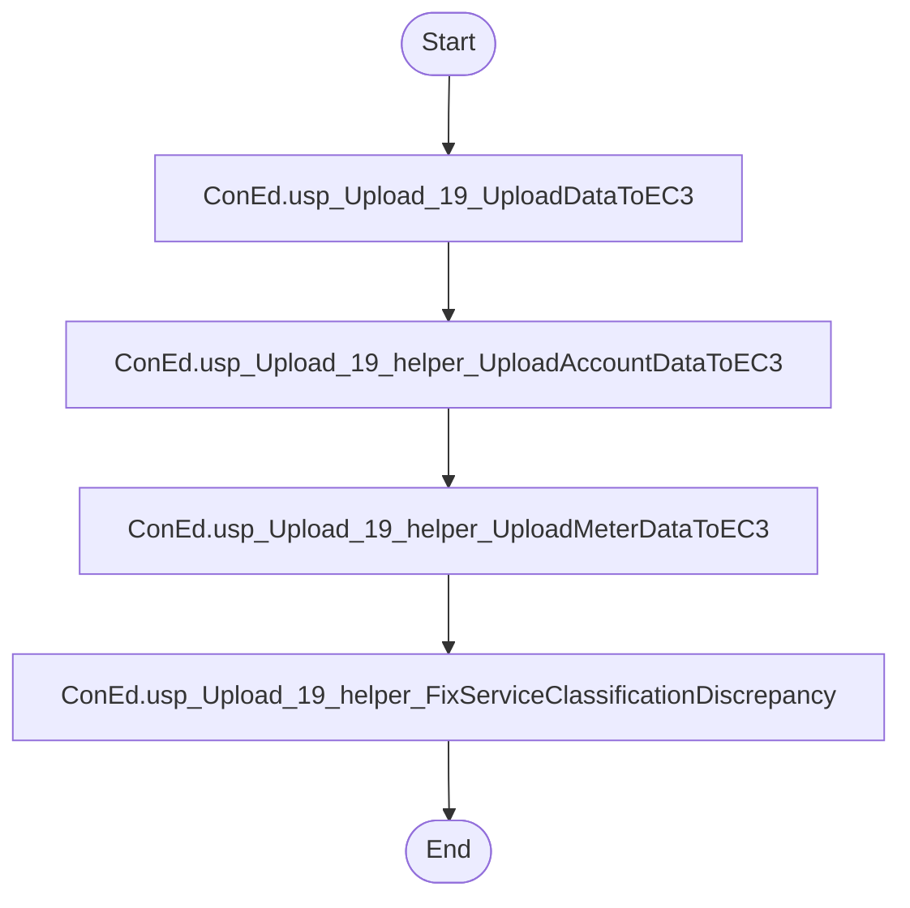

### 3. Step-by-Step Narrative (Complete Call Tree)

1. The process begins with the execution of the root procedure `[ConEd].[usp_Upload_19_UploadDataToEC3]`. This procedure is responsible for coordinating the entire data upload process to the EC3 system.

2. The procedure starts a transaction to ensure that all subsequent operations are completed successfully. This means that if any part of the process fails, all changes can be undone to prevent partial updates.

3. The first step within the transaction is to call `[ConEd].[usp_Upload_19_helper_UploadAccountDataToEC3]`. This helper procedure uploads customer account information to EC3, ensuring that all account data is current and accurate.

4. Once the account data is successfully uploaded, the process continues by calling `[ConEd].[usp_Upload_19_helper_UploadMeterDataToEC3]`. This step involves transferring meter reading data, which is crucial for accurate billing and usage tracking.

5. After the meter data is uploaded, the procedure calls `[ConEd].[usp_Upload_19_helper_FixServiceClassificationDiscrepancy]`. This step addresses any inconsistencies in service classifications, ensuring that all data aligns correctly with the expected standards.

6. If all steps are completed without errors, the transaction is committed, finalizing the data upload to EC3. This ensures that all changes are saved and the data is now up-to-date in the EC3 system.

7. In the event of an error at any point, the transaction is rolled back, meaning all changes are undone to maintain data integrity. An error message is generated to inform stakeholders of the issue.

8. The process concludes with the successful upload of data to EC3, or with a rollback if an error occurred, ensuring that the system remains consistent and reliable.

---

## ConEd.usp_Upload_18_ProcessExchange

### 1. Overview

The stored procedure `ConEd.usp_Upload_18_ProcessExchange` is designed to manage and process gas exchange data for a utility company. Its primary purpose is to update and reconcile account and meter information based on the latest billing period. This procedure is part of a larger data management process that ensures the utility's records are accurate and up-to-date, facilitating correct billing and account management.

The procedure begins by determining the current active billing period. It then cleans up outdated records and prepares to process new exchange data. A key part of this process involves calling another stored procedure, `ConEd.usp_Upload_18_Helper_ProcessCommonElectronicGasUnknownExchangeCode`, which handles specific tasks related to processing individual exchange records. This helper procedure is crucial for managing the detailed logic of updating exchange data.

Overall, this workflow ensures that the utility's data systems reflect the most current and accurate information, which is essential for operational efficiency and customer satisfaction.

### 2. Flow Diagram (Mermaid)

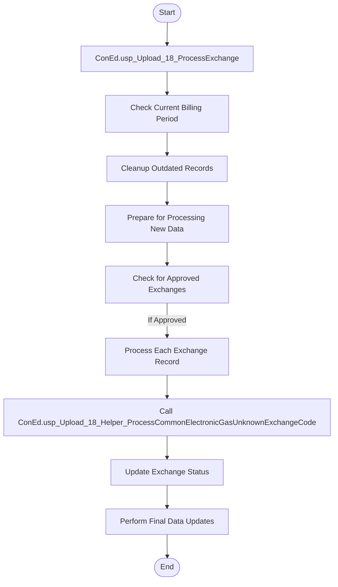

### 3. Step-by-Step Narrative (Complete Call Tree)

1. **Determine Current Billing Period**: The procedure starts by identifying the current active billing period. This is crucial as it sets the timeframe for which data will be processed.

2. **Cleanup Outdated Records**: It removes any records from the system that are older than the current billing period. This ensures that only relevant data is retained for processing.

3. **Prepare for Processing New Data**: The procedure checks how many exchange records are approved for processing. If none are approved, the procedure ends early.

4. **Process Each Exchange Record**: For each approved exchange record, the procedure initiates a detailed processing routine.

5. **Call Helper Procedure**: During the processing of each record, the procedure calls `ConEd.usp_Upload_18_Helper_ProcessCommonElectronicGasUnknownExchangeCode`. This helper procedure handles specific tasks related to processing the exchange, such as updating account and meter information.

6. **Update Exchange Status**: After processing each record, the procedure updates the status of the exchange to indicate it has been processed. This prevents reprocessing of the same data.

7. **Perform Final Data Updates**: The procedure concludes by updating various tables to reflect the new account and meter information, ensuring all data is synchronized and accurate.

8. **End**: The procedure completes its execution, leaving the data in a state ready for the next billing cycle or further processing as needed.

---

## ConEd.Archive_usp_ProcessConEdTransformMeterBillingData

### 1. Overview

The stored procedure `ConEd.Archive_usp_ProcessConEdTransformMeterBillingData` is designed to process and transform meter billing data for a utility company. Its main purpose is to organize and adjust billing records, ensuring that they accurately reflect the transactions and adjustments for a given billing period. This procedure is part of a larger data processing workflow that involves loading raw billing data, transforming it into a structured format, and resolving any discrepancies between account and meter readings.

The procedure begins by clearing out old summary data and then populates a summary table with new billing information. It calculates various billing metrics and adjusts records based on specific business rules. During its execution, it calls several other procedures to handle specific tasks:

- `ConEd.Archive_usp_ParseSplitBillingAndMeterResetsUploadConEdisonMeterInfo`: This procedure is responsible for handling billing and meter resets, ensuring that the data is correctly split and organized.
- `ConEd.Archive_usp_ParseSpannedBilledUploadConEdisonMeterInfo`: This procedure processes bills that span multiple periods, ensuring they are correctly parsed and recorded.

Additionally, the root procedure uses several helper functions to determine gas rates, therm factors, and calculate billing days. These functions help in deriving accurate billing metrics.

### 2. Flow Diagram (Mermaid)

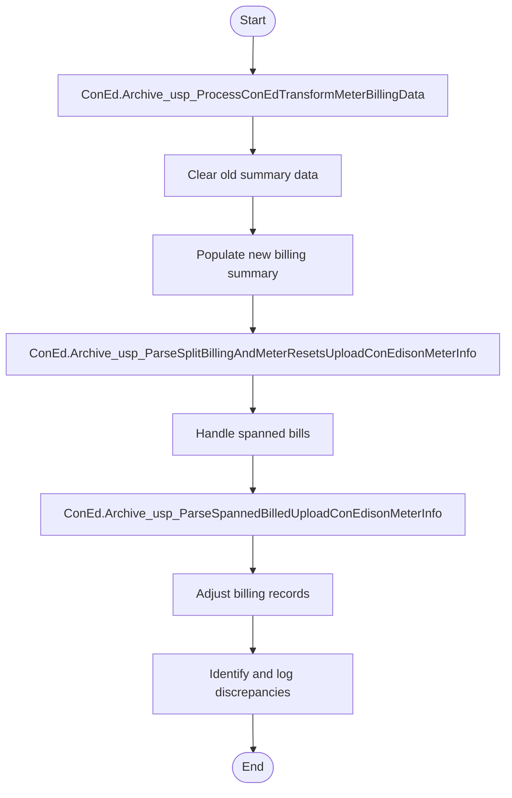

### 3. Step-by-Step Narrative (Complete Call Tree)

1. **Start the Process**: The procedure begins by preparing the environment for new billing data. It clears out any old data from the summary table to ensure that only the most recent and relevant data is processed.

2. **Populate Billing Summary**: The procedure then inserts new billing data into the summary table. It calculates various metrics such as the number of transactions, billing days, and therms, using helper functions to determine gas rates and therm factors.

3. **Handle Billing and Meter Resets**: The procedure calls `ConEd.Archive_usp_ParseSplitBillingAndMeterResetsUploadConEdisonMeterInfo`. This step ensures that any resets in billing or meter readings are correctly processed and organized.

4. **Process Spanned Bills**: The procedure identifies bills that cover more than one billing period and temporarily stores them. It then calls `ConEd.Archive_usp_ParseSpannedBilledUploadConEdisonMeterInfo` to parse these spanned bills, ensuring they are accurately recorded.

5. **Adjust Billing Records**: After handling spanned bills, the procedure adjusts the billing records to account for any rebills or corrections. It ensures that the billing period revisions are accurate and that the data reflects the correct billing actions.

6. **Identify and Log Discrepancies**: The procedure checks for any discrepancies between account and meter readings. It logs these discrepancies, updating the notes in the billing records to reflect any differences found.

7. **End the Process**: The procedure concludes by ensuring all data is correctly adjusted and logged, leaving the billing records in a state ready for further analysis or reporting.

---

## CrisNationalGridWest.usp_CRIS_SpanParseAndMergeCancellationAccountBillingAdjustmentRecords

### 1. Overview

The stored procedure `CrisNationalGridWest.usp_CRIS_SpanParseAndMergeCancellationAccountBillingAdjustmentRecords` is designed to handle the processing of billing cancellations for a utility company. Its primary purpose is to manage and update billing records when a cancellation occurs, ensuring that all relevant financial adjustments are accurately reflected in the system. This procedure is part of a larger billing adjustment process, which ensures that customer accounts are correctly updated with any changes due to cancellations.

The procedure performs several key tasks: it prepares tables for processing, extracts cancellation records, processes these records, and updates the necessary tables with the adjusted billing information. During its execution, it calls another stored procedure, `CrisNationalGridWest.usp_CRIS_PreProcessParsingSpannedAccountInfoCancellation`, which specifically handles the processing of records that span multiple billing periods. This collaboration ensures that both single-period and multi-period billing adjustments are handled seamlessly.

### 2. Flow Diagram (Mermaid)

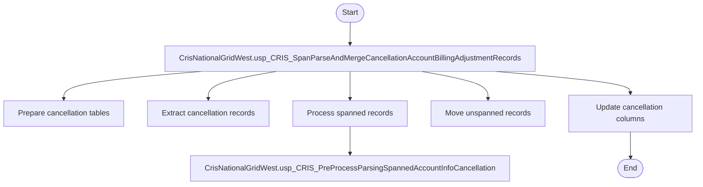

### 3. Step-by-Step Narrative (Complete Call Tree)

1. **Start**: The process begins with the stored procedure `CrisNationalGridWest.usp_CRIS_SpanParseAndMergeCancellationAccountBillingAdjustmentRecords`.

2. **Prepare Cancellation Tables**: The procedure first clears out any old data from the tables that will be used to store cancellation records. This ensures that the tables are ready to receive new data.

3. **Extract Cancellation Records**: It then extracts records that indicate a billing cancellation from the main billing details table. These records are filtered to exclude any that are marked for review, ensuring only finalized cancellations are processed.

4. **Process Spanned Records**: The procedure identifies records that span multiple billing periods and need special handling. It calls the stored procedure `CrisNationalGridWest.usp_CRIS_PreProcessParsingSpannedAccountInfoCancellation` to manage these complex records. This called procedure processes the spanned records, ensuring they are correctly adjusted and moved to a temporary table for further processing.

5. **Move Unspanned Records**: After handling the spanned records, the procedure moves records that do not span multiple periods directly into the temporary table for billing adjustments. This step ensures that all cancellation records, whether spanned or not, are consolidated in one place for final adjustments.

6. **Update Cancellation Columns**: Finally, the procedure updates the main billing adjustment table with the new cancellation data. It calculates and applies the necessary financial adjustments, such as changes in billed amounts and taxes, ensuring that the customer accounts reflect the correct balances after the cancellation.

7. **End**: The process concludes with all relevant billing records updated to reflect the cancellations, ensuring the system's data integrity and accuracy.

---

## CrisNationalGridWest.usp_CRIS_ValidateAccountTransactions

### 1. Overview

The stored procedure `[CrisNationalGridWest].[usp_CRIS_ValidateAccountTransactions]` is designed to validate and process account transactions for a specific billing period. Its primary purpose is to ensure that the transactions are accurate and to identify any discrepancies, such as net zero transactions or cancellations that need to be excluded from further processing. This procedure is part of a larger data validation and processing workflow that ensures the integrity of billing data before it is finalized and used for reporting or billing customers.

The procedure works by examining each transaction in the current billing period, checking for specific conditions like cancellations or rebills, and marking transactions that require further review. Although the procedure references another stored procedure, `[CrisNationalGridWest].[usp_CRIS_CorrectPartialCancelattionFromPriorPeriodMergedBill]`, it is commented out and not actively called in the current implementation. This suggests that the procedure is prepared to handle more complex scenarios involving partial cancellations, but this functionality is not currently in use.

### 2. Flow Diagram (Mermaid)

```mermaid
flowchart TD
    START([Start]) 
    --> ROOT[CrisNationalGridWest.usp_CRIS_ValidateAccountTransactions]
    ROOT -->|Fetch Transactions| FETCH[Fetch each transaction]
    FETCH -->|Check Transaction Type| CHECKTYPE[Check if transaction is a cancellation (BC) or billing (BI)]
    CHECKTYPE -->|Cancellation (BC)| CHECKCANCEL[Check for matching billing in current or previous periods]
    CHECKTYPE -->|Billing (BI)| CHECKBILL[Check for cancellation in current period]
    CHECKCANCEL --> UPDATE[Update transaction status]
    CHECKBILL --> UPDATE
    UPDATE --> END([End])
```

### 3. Step-by-Step Narrative (Complete Call Tree)

1. The process begins with the stored procedure `[CrisNationalGridWest].[usp_CRIS_ValidateAccountTransactions]`, which is responsible for validating account transactions for a given billing period.

2. The procedure starts by fetching each transaction from the current billing period. It prepares to examine each transaction individually to determine its type and status.

3. For each transaction, the procedure checks whether it is a cancellation (denoted by the code 'BC') or a regular billing transaction (denoted by the code 'BI').

4. If the transaction is a cancellation ('BC'), the procedure checks if there is a corresponding billing transaction in the current set of data or in previous periods. This helps identify if the cancellation is valid and should be excluded from processing.

5. If the transaction is a regular billing transaction ('BI'), the procedure checks if there is a cancellation for this transaction in the current period. This ensures that any billing that has been canceled is not processed further.

6. After determining the status of each transaction, the procedure updates the transaction records to reflect whether they should be excluded from further processing or require additional review.

7. Although the procedure includes a reference to another stored procedure, `[CrisNationalGridWest].[usp_CRIS_CorrectPartialCancelattionFromPriorPeriodMergedBill]`, this call is commented out. This indicates that while the procedure is set up to handle complex scenarios involving partial cancellations, this functionality is not currently active.

8. The process concludes with all transactions being marked appropriately, ensuring that only valid transactions are processed further, maintaining the integrity of the billing data.

---

## CrisNationalGridWest.usp_ProcessExchangeInfo

### 1. Overview

The stored procedure `CrisNationalGridWest.usp_ProcessExchangeInfo` is designed to manage and process exchange records for a utility company. Its primary purpose is to ensure that each exchange record is handled appropriately based on its type, which is identified by an "Exchange Code". This procedure is part of a larger system that deals with utility billing and account management, ensuring that data is processed accurately and efficiently.

The procedure begins by identifying the current active billing period, which is crucial for processing records in the correct timeframe. It then retrieves unprocessed exchange records and processes each one according to its specific exchange code. Depending on the exchange code, the procedure may call one of several other stored procedures to handle the record's specific requirements. These called procedures are responsible for detailed processing tasks such as updating account information, handling meter readings, or managing account terminations.

The other procedures called by this root procedure include:
- `CrisNationalGridWest.usp_ProcessExchangeCode_47`
- `CrisNationalGridWest.usp_ProcessExchangeCode_46`
- `CrisNationalGridWest.usp_ProcessExchangeCode_45`
- `CrisNationalGridWest.usp_ProcessExchangeCode_28`
- `CrisNationalGridWest.usp_ProcessExchangeCode_27`
- `CrisNationalGridWest.usp_ProcessExchangeCode_MISC`

Each of these procedures is tailored to handle specific types of exchange records, ensuring that the data is processed correctly and any necessary updates are made to the system.

### 2. Flow Diagram (Mermaid)

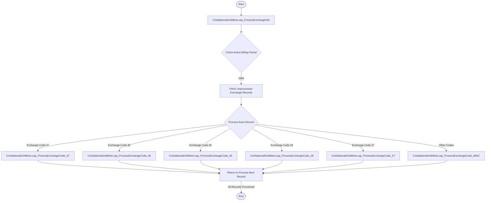

### 3. Step-by-Step Narrative (Complete Call Tree)

1. **Start the Process**: The procedure begins by setting up necessary variables and checking for the current active billing period. This ensures that all records are processed within the correct timeframe.

2. **Check Active Billing Period**: It looks up the current billing period from the system. If no active period is found, the process stops with an error.

3. **Fetch Unprocessed Exchange Records**: The procedure retrieves all exchange records that have not yet been processed and are not marked for exclusion.

4. **Process Each Record**: For each record, it checks the exchange code to determine the appropriate action:
   - **Exchange Code 47**: Calls `CrisNationalGridWest.usp_ProcessExchangeCode_47` to handle specific updates related to this code.
   - **Exchange Code 46**: Calls `CrisNationalGridWest.usp_ProcessExchangeCode_46` for processing tasks unique to this code.
   - **Exchange Code 45**: Calls `CrisNationalGridWest.usp_ProcessExchangeCode_45` to manage tasks associated with this code.
   - **Exchange Code 28**: Calls `CrisNationalGridWest.usp_ProcessExchangeCode_28` to process account termination records.
   - **Exchange Code 27**: Calls `CrisNationalGridWest.usp_ProcessExchangeCode_27` for meter-related updates.
   - **Other Codes**: Calls `CrisNationalGridWest.usp_ProcessExchangeCode_MISC` for any miscellaneous codes not specifically handled by the other procedures.

5. **Return to Process Next Record**: After processing each record, the procedure returns to handle the next unprocessed record.

6. **End the Process**: Once all records have been processed, the procedure concludes, ensuring that all necessary updates have been made to the system.

---

## Gas.usp_ProcessCommonElectronicGasUnknownExchangeDataByCursor

### 1. Overview

The stored procedure `Gas.usp_ProcessCommonElectronicGasUnknownExchangeDataByCursor` is designed to manage and process gas exchange data that is not yet fully identified or categorized. This procedure is part of a larger system that handles the exchange of gas billing and metering information between different utility companies and internal systems. Its primary purpose is to ensure that all gas exchange data is correctly processed, updated, and stored for future reference and billing adjustments.

The procedure begins by identifying the current billing period and ensuring that it is valid. It then cleans up outdated or irrelevant data to prepare for new processing. The core of the procedure involves iterating over a set of gas exchange records that are approved for processing. For each record, it calls another procedure, `Gas.usp_ProcessCommonElectronicGasUnknownExchangeCode`, which handles the specific processing of each exchange record. After processing, it updates the status of the records to prevent reprocessing.

The procedure also updates various tables to reflect the new state of the data, ensuring that all related billing and metering information is synchronized with the latest exchange data. This includes updating account and meter identifiers to align with the processed exchange data.

### 2. Flow Diagram (Mermaid)

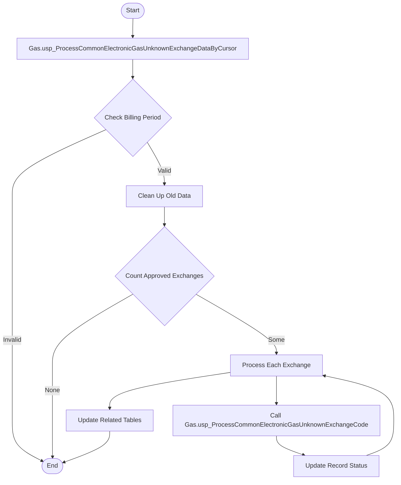

### 3. Step-by-Step Narrative (Complete Call Tree)

1. **Start the Process**: The procedure begins by determining the current active billing period. This is crucial as it sets the context for which data should be processed.

2. **Validate Billing Period**: It checks if the billing period is valid. If not, the procedure exits early, as processing cannot continue without a valid period.

3. **Clean Up Old Data**: The procedure removes outdated or irrelevant data from the system to ensure that only current and relevant data is processed.

4. **Count Approved Exchanges**: It counts the number of gas exchange records that are approved for processing. If there are no approved records, the procedure exits, as there is nothing to process.

5. **Process Each Exchange**: For each approved exchange record, the procedure enters a loop to process them one by one.

6. **Call Another Procedure**: For each record, it calls the `Gas.usp_ProcessCommonElectronicGasUnknownExchangeCode` procedure. This procedure is responsible for handling the specific details of processing each exchange record, ensuring that all necessary data transformations and validations are performed.

7. **Update Record Status**: After processing each record, the procedure updates its status to indicate that it has been processed. This prevents the same record from being processed again in the future.

8. **Update Related Tables**: Once all records are processed, the procedure updates various related tables. This step ensures that all account and meter information is synchronized with the newly processed exchange data, reflecting any changes or updates that occurred during processing.

9. **End the Process**: The procedure concludes, leaving the system with updated and synchronized gas exchange data ready for further use in billing and reporting.

---

## NationalGridWest.usp_LegacyData_ProcessAccountSpanned

### 1. Overview

The stored procedure `NationalGridWest.usp_LegacyData_ProcessAccountSpanned` is designed to manage and process billing data for accounts that span multiple billing periods. This procedure is part of a larger data processing workflow that ensures accurate billing information is maintained and adjusted as necessary. The primary goal of this procedure is to handle complex billing scenarios where accounts have overlapping or extended billing periods, which are referred to as "spanned" accounts.

The procedure begins by moving relevant records into a temporary table for further processing. It then calls another procedure, `NationalGridWest.usp_LegacyData_ParseSpannedAccountInfo`, to parse and organize the spanned account information. After parsing, the procedure updates gas rate codes for the accounts and finally moves the processed data into an adjustment table, ensuring that all billing adjustments are accurately recorded.

### 2. Flow Diagram (Mermaid)

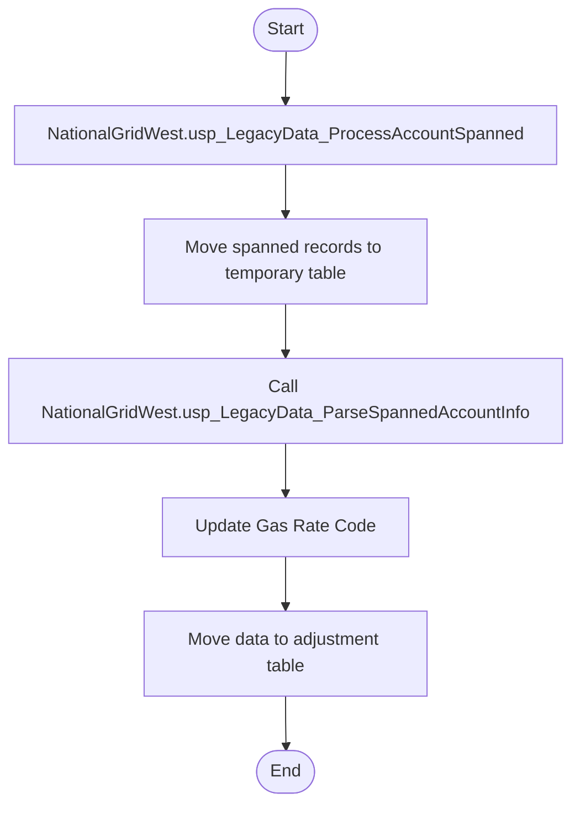

### 3. Step-by-Step Narrative (Complete Call Tree)

1. **Initialize and Prepare Data**: The procedure begins by setting up necessary variables and preparing to process accounts with spanned billing periods. It identifies records that need special handling due to their extended billing periods.

2. **Move Spanned Records**: The procedure moves these identified records into a temporary table called `UploadLegacyKeyspanWestAccountTempSummarySpanned`. This step organizes the data for further processing and ensures that only relevant records are handled.

3. **Parse Spanned Account Information**: The procedure calls `NationalGridWest.usp_LegacyData_ParseSpannedAccountInfo`, passing along key parameters. This called procedure is responsible for breaking down and organizing the spanned account data, ensuring that all necessary details are extracted and prepared for further processing.

4. **Update Gas Rate Code**: After parsing, the procedure updates the gas rate codes for the accounts. It sets a default rate code and then adjusts it based on specific account information, ensuring that the correct rates are applied to each account.

5. **Move Data to Adjustment Table**: Finally, the procedure moves the processed data into the `UploadLegacyKeyspanWestAccountBillingAdjustmentGas` table. This step records all necessary billing adjustments, ensuring that the billing data reflects any changes due to the spanned periods.

6. **Completion**: The procedure completes its execution, leaving the billing data in a state where it accurately reflects all necessary adjustments for accounts with spanned billing periods. This ensures that subsequent billing processes can rely on this adjusted data for accurate billing and reporting.

---

## NationalGridWest.usp_LegacyData_ProcessAccountCancellationSpanned

### 1. Overview

The stored procedure `NationalGridWest.usp_LegacyData_ProcessAccountCancellationSpanned` is designed to handle the processing of account cancellations that span multiple billing periods. This procedure is part of a larger system that manages legacy data for a utility company, specifically focusing on the cancellation of accounts and the necessary adjustments in billing records.

The overall purpose of this procedure is to ensure that account cancellations are accurately reflected in the company's records, particularly when these cancellations affect more than one billing period. It involves moving data into temporary tables, parsing detailed cancellation information, setting appropriate gas rate codes, and merging this data into adjustment records.

Within this process, the procedure calls another stored procedure, `NationalGridWest.usp_LegacyData_ParseSpannedAccountCancellationInfo`, which plays a crucial role in parsing and organizing the detailed information about the cancellations. Additionally, it utilizes several helper functions to calculate factors like gas therms and billing days, ensuring that all adjustments are precise and consistent.

### 2. Flow Diagram (Mermaid)

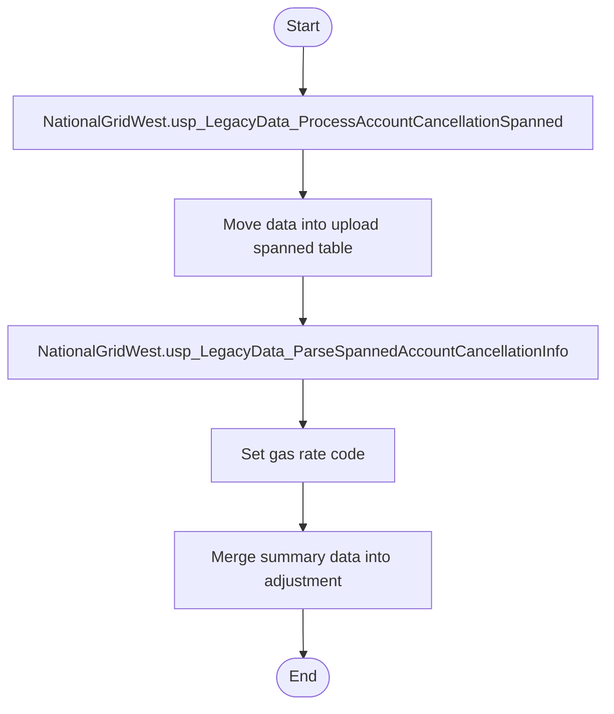

### 3. Step-by-Step Narrative (Complete Call Tree)

1. **Start the Process**: The procedure begins by moving relevant data into a temporary table designed to handle cancellations that span multiple billing periods. This step ensures that all necessary information is gathered in one place for further processing.

2. **Parse Detailed Information**: The procedure then calls `NationalGridWest.usp_LegacyData_ParseSpannedAccountCancellationInfo`. This called procedure is responsible for parsing and organizing detailed information about each account cancellation. It ensures that all the necessary details are extracted and prepared for further processing.

3. **Set Gas Rate Code**: After parsing the information, the procedure sets a default gas rate code for the cancellations. It then updates this rate code based on specific conditions, ensuring that the correct tariff rates are applied to each account.

4. **Merge Data into Adjustments**: The procedure proceeds to merge the summarized cancellation data into the existing billing adjustment records. This step involves updating the adjustment records with the new cancellation information, ensuring that all transactions are accurately reflected in the company's billing system.

5. **Finalize the Process**: The procedure concludes by ensuring that all cancellations are correctly recorded, including any necessary updates to the billing periods and rates. This final step ensures that the company's records are up-to-date and accurate, reflecting all recent account cancellations.

---

## NationalGridWest.usp_LegacyData_ProcessMeterUnspanned

### 1. Overview

The stored procedure `NationalGridWest.usp_LegacyData_ProcessMeterUnspanned` is designed to process and manage historical meter data for a utility company. Its primary purpose is to ensure that meter readings and billing data are accurately recorded and adjusted, especially in cases where there are discrepancies or special conditions like meter resets or account cancellations. This procedure is part of a larger data management process that involves loading, validating, and summarizing utility billing data.

The procedure begins by loading raw meter data into a temporary workspace, where it performs various calculations and adjustments to ensure the data's accuracy. It then updates the main data tables with this processed information. The procedure also calls other stored procedures to handle specific tasks: `NationalGridWest.usp_LegacyData_ProrateAccountBillingUsageToMeterBilling` is used to distribute billing usage across multiple meters, and `NationalGridWest.usp_LegacyData_ParseSplitBillingAndMeterResets` is invoked to handle cases where meter readings need to be split or reset. These additional procedures help ensure that the data is comprehensive and reflects the actual usage and billing conditions.

### 2. Flow Diagram (Mermaid)

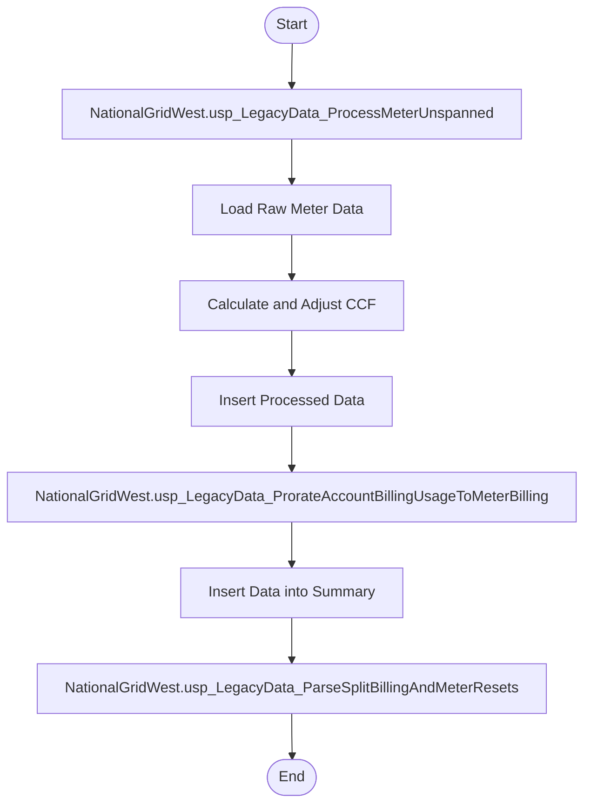

### 3. Step-by-Step Narrative (Complete Call Tree)

1. **Load Raw Meter Data**: The procedure starts by loading raw meter data into a temporary table. This data includes meter readings and billing information, which are essential for further processing.

2. **Calculate and Adjust CCF**: The procedure calculates the CCF (hundred cubic feet) values, which are crucial for billing. It adjusts these values to account for any discrepancies, such as meter resets or incorrect readings.

3. **Insert Processed Data**: After calculations, the procedure inserts the processed data back into the main data table. This step ensures that the billing records are up-to-date and accurate.

4. **Prorate Usage**: The procedure calls `NationalGridWest.usp_LegacyData_ProrateAccountBillingUsageToMeterBilling` to distribute the billing usage across multiple meters. This step is necessary for accounts with more than one meter, ensuring that each meter's usage is correctly accounted for.

5. **Insert Data into Summary**: The procedure then inserts the processed and prorated data into a summary table. This table provides a consolidated view of the billing data, which is useful for reporting and analysis.

6. **Parse Meter Resets**: Finally, the procedure calls `NationalGridWest.usp_LegacyData_ParseSplitBillingAndMeterResets` to handle any cases where meter readings need to be split or reset. This ensures that the data accurately reflects any changes in meter conditions.

7. **End**: The procedure concludes, leaving the data in a state that accurately represents the utility usage and billing for the period in question. This comprehensive process ensures that all aspects of the meter data are correctly processed and recorded.

---

## NationalGridWest.usp_LegacyData_ProcessMeterCancellationSpanned

### 1. Overview

The stored procedure `NationalGridWest.usp_LegacyData_ProcessMeterCancellationSpanned` is designed to manage and process meter cancellation data for a utility company. Its primary purpose is to handle complex billing scenarios where meter readings and cancellations span multiple billing periods. This procedure is part of a larger data processing workflow that ensures accurate billing adjustments and updates to the company's records.

The procedure begins by moving relevant data into a temporary table for processing. It then calls another procedure, `NationalGridWest.usp_LegacyData_ParseSpannedMeterCancellationInfo`, to further parse and organize the data. After parsing, the procedure updates gas rate codes to ensure they reflect the correct billing rates. Finally, it merges the processed data into an adjustment table, ensuring that all billing transactions, including cancellations and rebills, are accurately recorded and updated.

### 2. Flow Diagram (Mermaid)

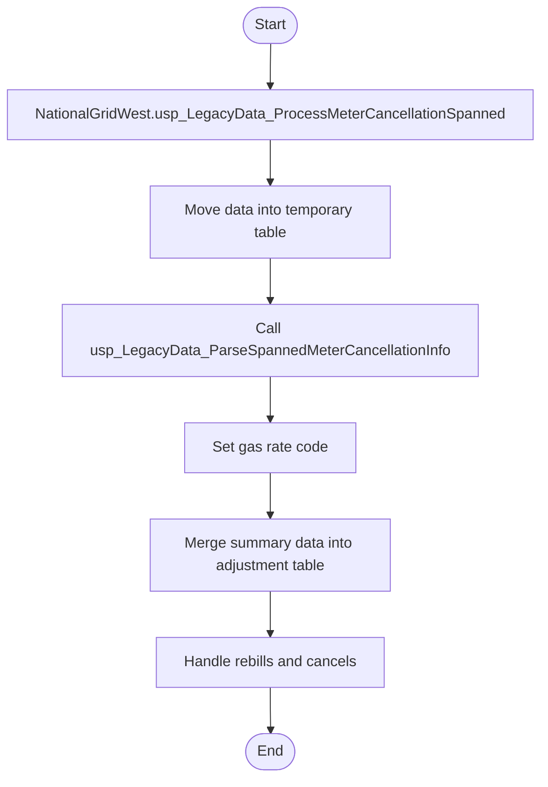

### 3. Step-by-Step Narrative (Complete Call Tree)

1. **Move Data into Temporary Table**: The procedure starts by transferring meter cancellation data into a temporary table. This step organizes the data for further processing, focusing on records that span multiple billing periods.

2. **Call to Parse Data**: The procedure then calls `NationalGridWest.usp_LegacyData_ParseSpannedMeterCancellationInfo`. This called procedure is responsible for parsing the spanned meter cancellation information, ensuring that the data is correctly structured and ready for further processing.

3. **Set Gas Rate Code**: After parsing, the procedure updates the gas rate codes in the data. It first sets a default rate code and then updates it to reflect the actual commodity tariff rate from another database table, ensuring that the billing reflects the correct rates.

4. **Merge Data into Adjustment Table**: The procedure merges the processed data into an adjustment table. This step consolidates all transactions, including cancellations and rebills, ensuring that the company's billing records are accurate and up-to-date.

5. **Handle Rebills and Cancels**: The procedure then addresses any rebills and cancels by updating existing records and deleting unnecessary ones. It ensures that only the most accurate and relevant data remains in the adjustment table.

6. **Finish**: The procedure concludes by ensuring that all data is correctly processed and stored, leaving the company's billing records in a consistent and accurate state.

---

## NationalGridWest.usp_LegacyData_ProcessMeterSpanned

### 1. Overview

The stored procedure `NationalGridWest.usp_LegacyData_ProcessMeterSpanned` is designed to manage and process legacy meter data for a specific billing period. Its primary purpose is to handle data that spans multiple billing periods, ensuring that all relevant information is accurately captured and adjusted for billing purposes. This procedure is part of a larger data processing workflow that involves moving, parsing, updating, and adjusting meter data to ensure accurate billing and reporting.

The procedure begins by transferring data into a temporary table for processing. It then calls another procedure, `NationalGridWest.usp_LegacyData_ParseSpannedMeterInfo`, to further parse and refine the spanned meter information. After parsing, the procedure updates gas rate codes and merges summary data into an adjustment table. It also updates specific fields to correct any discrepancies and logs notes for meters with billing discrepancies. The overall process ensures that the data is correctly adjusted and ready for accurate billing.

### 2. Flow Diagram (Mermaid)

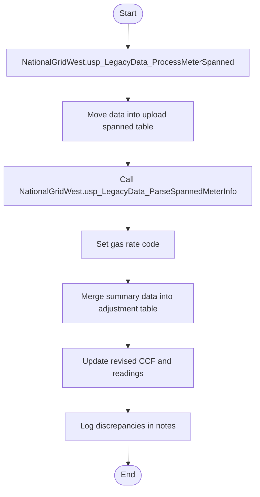

### 3. Step-by-Step Narrative (Complete Call Tree)

1. **Move Data into Temporary Table**: The procedure starts by moving relevant meter data into a temporary table specifically designed for handling spanned billing periods. This step ensures that only the necessary data is processed further.

2. **Parse Spanned Meter Information**: The procedure calls `NationalGridWest.usp_LegacyData_ParseSpannedMeterInfo` to parse and refine the spanned meter data. This step is crucial for breaking down the data into manageable parts and ensuring that all necessary details are captured.

3. **Set Gas Rate Code**: After parsing, the procedure sets a default gas rate code for all records. It then updates this code to match the commodity tariff rate from another system, ensuring that the correct rate is applied to each account.

4. **Merge Summary Data**: The procedure merges the processed data into an adjustment table. This step consolidates the data, calculates necessary metrics, and prepares it for final adjustments. It ensures that all transactions are accounted for and that the data is ready for billing.

5. **Update Revised CCF and Readings**: The procedure updates specific fields, such as the revised billed CCF and meter readings, to correct any discrepancies found during processing. This ensures that the final data reflects accurate usage and billing information.

6. **Log Discrepancies in Notes**: Finally, the procedure logs any discrepancies between account and meter-reported billing in the notes field. This step provides a record of any issues that need to be addressed and ensures transparency in the billing process.

7. **End**: The procedure completes its execution, leaving the data in a state ready for accurate billing and reporting.

---

## Nypa.usp_ProcessNYPATransformUploadedData

### 1. Overview

The stored procedure `[Nypa].[usp_ProcessNYPATransformUploadedData]` is designed to manage and transform billing and account data for a utility company. Its primary purpose is to process uploaded data, ensuring it is correctly formatted and stored in the appropriate tables for further analysis and reporting. This procedure is a crucial part of the data transformation and loading process, which prepares raw data for use in billing systems and other financial analyses.

The procedure begins by clearing out existing data in several staging tables to make room for new data. It then inserts transformed data from preloaded tables into these staging tables. This process involves converting and formatting various fields to ensure consistency and accuracy. After the initial data transformation, the procedure calls two other stored procedures: `[Nypa].[usp_ProcessNYPATransformEncoreData]` and `[Nypa].[usp_ProcessNypaAddReactivePowerData]`. These procedures further process the data, handling specific tasks such as additional data transformations and calculations related to reactive power data.

Overall, this stored procedure and its called procedures work together to ensure that the utility company's billing and account data is accurately transformed and ready for use in downstream applications, such as billing systems and financial reports.

### 2. Flow Diagram (Mermaid)

```mermaid
flowchart TD
    START([Start]) 
    --> ROOT[Nypa.usp_ProcessNYPATransformUploadedData]
    ROOT --> CLEAR1[Clear UploadNYPAAccountBilling Table]
    ROOT --> INSERT1[Insert Transformed Data into UploadNYPAAccountBilling]
    ROOT --> CLEAR2[Clear UploadNYPAExchangeData Table]
    ROOT --> INSERT2[Insert Transformed Data into UploadNYPAExchangeData]
    ROOT --> CLEAR3[Clear UploadNYPACoverSheet Table]
    ROOT --> INSERT3[Insert Transformed Data into UploadNYPACoverSheet]
    ROOT --> CLEAR4[Clear UploadNYPAMeterBilling Table]
    ROOT --> INSERT4[Insert Transformed Data into UploadNYPAMeterBilling]
    ROOT --> CLEAR5[Clear UploadNypaAllActiveAccounts Table]
    ROOT --> INSERT5[Insert Transformed Data into UploadNypaAllActiveAccounts]
    ROOT --> CLEAR6[Clear UploadNypaIntervalMeterData Table]
    ROOT --> INSERT6[Insert Transformed Data into UploadNypaIntervalMeterData]
    ROOT --> EXEC1[Nypa.usp_ProcessNYPATransformEncoreData]
    EXEC1 --> RETURN1[Return to Root Procedure]
    ROOT --> CLEAR7[Clear UploadNYPAKvarAccountMeterDetail Table]
    ROOT --> INSERT7[Insert Transformed Data into UploadNYPAKvarAccountMeterDetail]
    ROOT --> CLEAR8[Clear UploadNypaPage3CutomerLevelAllocation Table]
    ROOT --> INSERT8[Insert Transformed Data into UploadNypaPage3CutomerLevelAllocation]
    ROOT --> EXEC2[Nypa.usp_ProcessNypaAddReactivePowerData]
    EXEC2 --> RETURN2[Return to Root Procedure]
    ROOT --> SETSTATUS[Set Status Code to Success]
    SETSTATUS --> END([End])
```

### 3. Step-by-Step Narrative (Complete Call Tree)

1. **Start the Process**: The procedure begins by preparing the environment for new data. It clears out existing data from several tables to ensure that the new data can be inserted without conflicts.

2. **Clear and Insert Data**: The procedure clears the `UploadNYPAAccountBilling` table and inserts transformed data from a preloaded table. This step ensures that the account billing data is up-to-date and correctly formatted.

3. **Repeat for Other Tables**: Similar steps are repeated for other tables, such as `UploadNYPAExchangeData`, `UploadNYPACoverSheet`, `UploadNYPAMeterBilling`, `UploadNypaAllActiveAccounts`, and `UploadNypaIntervalMeterData`. Each table is cleared and then populated with transformed data, ensuring consistency across the dataset.

4. **Call to Transform Encore Data**: The procedure calls `[Nypa].[usp_ProcessNYPATransformEncoreData]`, which further processes the data, likely handling specific transformations or calculations related to encore data. Once this procedure completes, control returns to the root procedure.

5. **Continue Data Processing**: The root procedure continues by clearing and inserting data into the `UploadNYPAKvarAccountMeterDetail` and `UploadNypaPage3CutomerLevelAllocation` tables, ensuring all relevant data is transformed and stored.

6. **Call to Add Reactive Power Data**: The procedure calls `[Nypa].[usp_ProcessNypaAddReactivePowerData]`, which processes reactive power data, a specific type of data related to power usage. After this procedure completes, control returns to the root procedure.

7. **Finalize the Process**: The procedure sets a status code indicating success, signaling that the entire data transformation and loading process has completed successfully.

8. **End the Process**: The procedure ends, leaving the data in a state ready for further use in billing systems and financial reports.

---

## Nypa.usp_ProcessExchangeInfo

### 1. Overview

The stored procedure `[Nypa].[usp_ProcessExchangeInfo]` is designed to manage and process exchange data for utility companies. Its primary purpose is to handle records that have not yet been processed, ensuring that each record is dealt with according to its specific exchange code. This procedure is part of a larger system that manages billing and exchange information, ensuring data integrity and proper transaction handling.

The procedure begins by identifying the current active billing period. It then processes each unprocessed exchange record from a specific data table. Depending on the type of exchange code associated with each record, it calls one of several other procedures to handle the specific business logic required for that code. These procedures are:

- `Nypa.usp_ProcessExchangeCode_AX`
- `Nypa.usp_ProcessExchangeCode_46`
- `Nypa.usp_ProcessExchangeCode_47`
- `Nypa.usp_ProcessExchangeCode_45`
- `Nypa.usp_ProcessExchangeCode_28`
- `Nypa.usp_ProcessExchangeCode_27`

Each of these procedures is responsible for processing records with a specific exchange code, ensuring that the data is correctly updated and any necessary transactions are committed or rolled back based on the outcome of the processing.

### 2. Flow Diagram (Mermaid)

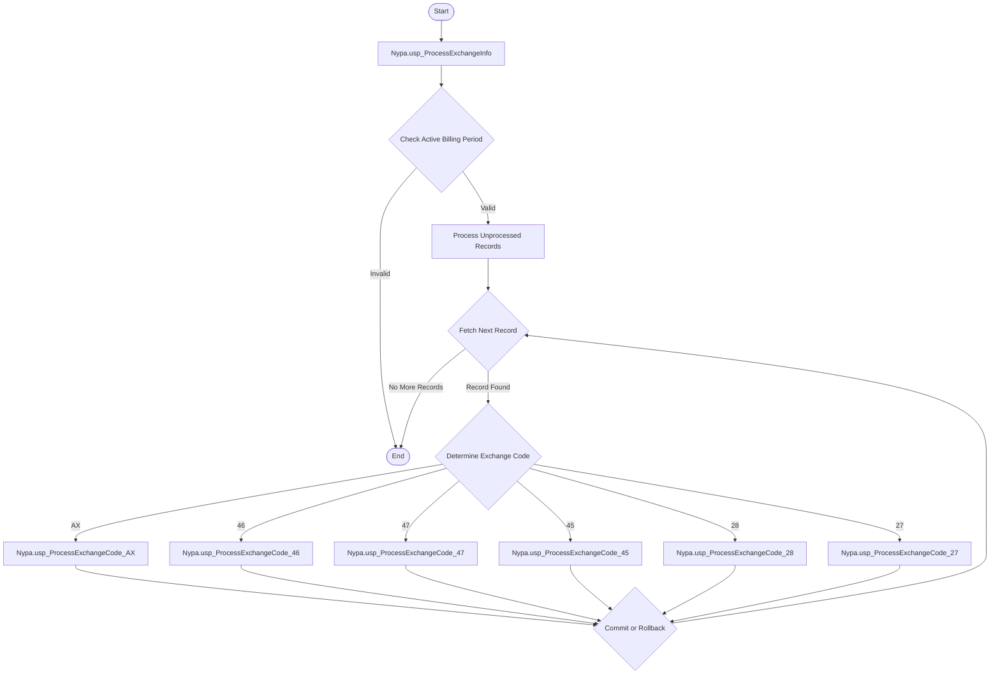

### 3. Step-by-Step Narrative (Complete Call Tree)

1. The process begins by checking the current active billing period. This ensures that there is a valid period for processing the exchange data.
   
2. If a valid billing period is found, the procedure proceeds to process records that have not yet been processed. It retrieves these records from a specific data table.

3. For each unprocessed record, the procedure determines the type of exchange code associated with it. This code dictates which specific processing logic should be applied.

4. Depending on the exchange code, the procedure calls one of the following specialized procedures:
   - `Nypa.usp_ProcessExchangeCode_AX` for code 'AX'
   - `Nypa.usp_ProcessExchangeCode_46` for code '46'
   - `Nypa.usp_ProcessExchangeCode_47` for code '47'
   - `Nypa.usp_ProcessExchangeCode_45` for code '45'
   - `Nypa.usp_ProcessExchangeCode_28` for code '28'
   - `Nypa.usp_ProcessExchangeCode_27` for code '27'

5. Each of these procedures processes the record according to the business rules associated with its exchange code. This might involve updating records, performing calculations, or other data manipulations.

6. After processing a record, the procedure decides whether to commit or roll back the transaction based on the success or failure of the processing.

7. The procedure continues to fetch and process records until all unprocessed records have been handled.

8. Once all records are processed, or if no valid billing period is found, the procedure concludes, ensuring that all data is left in a consistent state.

---

## Published.usp_CreatePublishedTablesFromViewsForCurrentBillingPeriod

### 1. Overview

The stored procedure `[Published].[usp_CreatePublishedTablesFromViewsForCurrentBillingPeriod]` is designed to manage and process billing data for the current billing period. Its primary purpose is to prepare and organize data for reporting and analysis by transforming raw data into structured tables that reflect the latest billing information. This procedure is part of a larger data processing workflow that ensures billing data is accurate, up-to-date, and ready for further analysis or reporting.

The procedure begins by determining the current billing period and then performs several key tasks, including clearing outdated data, loading new data, and updating various summary tables. It also calls several other procedures to handle specific tasks, such as truncating old data, creating summaries, and generating extracts for external systems. These called procedures play crucial roles in ensuring data integrity and completeness throughout the process.

### 2. Flow Diagram (Mermaid)

```mermaid
flowchart TD
    START([Start]) --> ROOT[Published.usp_CreatePublishedTablesFromViewsForCurrentBillingPeriod]
    ROOT --> |Determine Current Billing Period| A[Set Billing Period]
    ROOT --> |Clear Old Data| B[Temporal.usp_TruncatePublishingTables]
    ROOT --> |Load New Data| C[Insert into AccountMeterLevelRawData]
    ROOT --> |Load New Data| D[Insert into AccountLevelRawData]
    ROOT --> |Update Summaries| E[Published.usp_Create_EnergyUsageSummaryGroupByAgencyAndEnergyType]
    ROOT --> |Generate Reports| F[Published.usp_CreateAccountLevelSummaryByDollarsBtusCo2AndEnergyType]
    ROOT --> |Generate Reports| G[Published.usp_CreateSummarizededDollarsBtusAndCo2ByAgencyDivisionHierarchy]
    ROOT --> |Create Extracts| H[Published.usp_SSIS_CreateDEPExtractInSeptsFormat]
    ROOT --> |Create Extracts| I[Published.usp_SSIS_CreateSeptsCsvExtract]
    ROOT --> |Count Rows| J[Published.usp_Utility_CountRowsPublishedDataByPublishedBillingPeriod]
    ROOT --> |Reindex Tables| K[Utils.usp_ReindexTablesAfterPublishing]
    ROOT --> |Update Hash Values| L[Temporal.HashValueUpdateforPublishedTables]
    ROOT --> |Insert Temporal Data| M[Temporal.usp_ProcessAndInsertTemporalData]
    ROOT --> |Reindex Temporal Tables| N[Utils.usp_ReindexTemporalTablesAfterPublishing]
    ROOT --> END([End])
```

### 3. Step-by-Step Narrative (Complete Call Tree)

1. **Determine Current Billing Period**: The procedure starts by identifying the current billing period from the system's timeframe settings. This sets the context for all subsequent data processing.

2. **Clear Old Data**: It calls `[Temporal].[usp_TruncatePublishingTables]` to remove outdated data from legacy tables, ensuring that only the most recent and relevant data is processed.

3. **Load New Data**: The procedure inserts fresh billing data into two main tables: `AccountMeterLevelRawDataForCurrentPeriod` and `AccountLevelRawDataForCurrentPeriod`. This step involves copying data from views that contain the latest billing information.

4. **Update Summaries**: It calls `[Published].[usp_Create_EnergyUsageSummaryGroupByAgencyAndEnergyType]` to generate summaries of energy usage, grouped by agency and energy type. This helps in understanding consumption patterns.

5. **Generate Reports**: The procedure executes `[Published].[usp_CreateAccountLevelSummaryByDollarsBtusCo2AndEnergyType]` and `[Published].[usp_CreateSummarizededDollarsBtusAndCo2ByAgencyDivisionHierarchy]` to create detailed reports on billing amounts, energy usage, and environmental impact metrics like BTUs and CO2 emissions.

6. **Create Extracts**: It generates data extracts for external systems by calling `[Published].[usp_SSIS_CreateDEPExtractInSeptsFormat]` and `[Published].[usp_SSIS_CreateSeptsCsvExtract]`. These extracts are formatted for specific external requirements.

7. **Count Rows**: The procedure calls `[Published].[usp_Utility_CountRowsPublishedDataByPublishedBillingPeriod]` to verify the number of rows processed, ensuring data completeness and accuracy.

8. **Reindex Tables**: It reindexes tables using `[Utils].[usp_ReindexTablesAfterPublishing]` to optimize performance and speed up data retrieval.

9. **Update Hash Values**: The procedure updates hash values on legacy tables by executing `[Temporal].[HashValueUpdateforPublishedTables]`, which helps in maintaining data integrity.

10. **Insert Temporal Data**: It inserts processed data into temporal tables by calling `[Temporal].[usp_ProcessAndInsertTemporalData]`, ensuring historical data tracking.

11. **Reindex Temporal Tables**: Finally, it reindexes temporal tables using `[Utils].usp_ReindexTemporalTablesAfterPublishing` to maintain optimal performance.

12. **Complete Process**: The procedure concludes by setting the database recovery model back to full, ensuring that the database is ready for future transactions and data processing tasks.

---